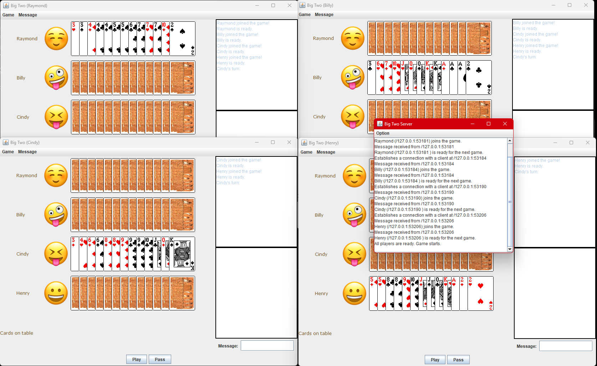

# BigTwo_Java

BigTwo is an online multi-player BigTwo poker game coded in Java.

This is a coursework project that scored **99 out of 100**.

Technical features include:

- Object-oriented Programming (OOP)
- Graphical User Interface Designed in Java
- Multi-threaded event handling
- Networking (socket) to allow multi-player

Steps to play:
1. Compile BigTwo (javac BigTwo.java) and BigTwoServer (javac BigTwoServer.java)
2. Start BigTwoServer (java BigTwoServer)
3. Players join with the command: java BigTwo 127.0.0.1:2396
